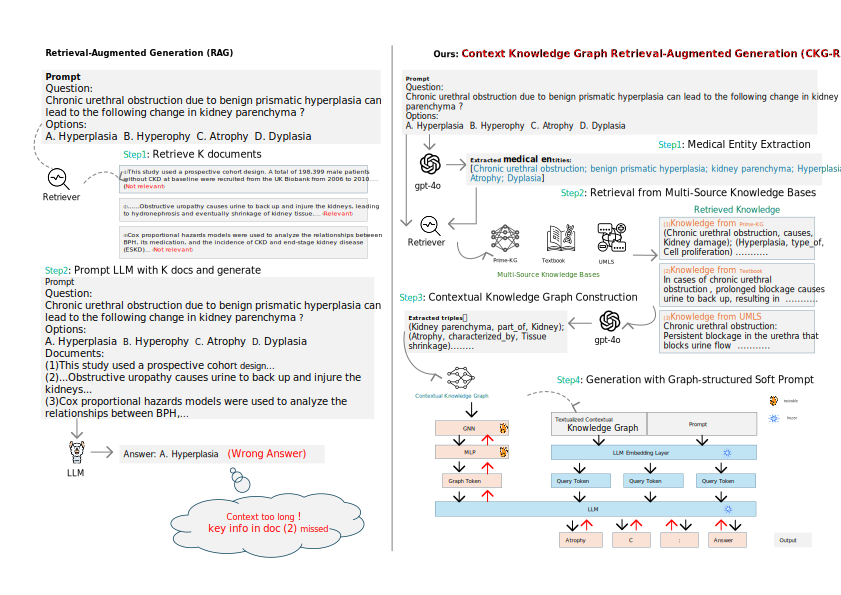

<div align="center">

# CKG-RAG: Enhancing LLM Reasoning in Medical Domain Using Contextual Knowledge Graphs


</div>

This includes the original implementation of CKG-RAG: Enhancing LLM Reasoning in Medical Domain Using Contextual Knowledge Graphs.


## 📌 Abstract

Retrieval-augmented generation (RAG) has achieved significant progress in the medical question answering (MQA) domain. However, introducing multiple relevant passages in the retrieval stage frequently leads to excessively long input sequences. In such cases, large language models (LLMs) tend to focus on the beginning and end of the context while neglecting the middle content, a phenomenon known as lost in the middle, which ultimately undermines answer accuracy. To address this issue, we proposed CKG-RAG, a novel framework based on knowledge graph (KG) and soft prompting. First, we organize the retrieved documents into a structured KG to reduce semantic redundancy. Second, unlike conventional approaches that flatten graphs into natural language sequences, we adopt a soft prompting mechanism that incorporates graph-structured information into learnable prompt vectors, guiding the model toward structure-aware reasoning. We validate the effectiveness and advancement of our framework on multiple public MQA datasets.

## 🖼️ Framework

<p align="center">
  
</p>


## 📋 Content
1. [⚙️ Installation](#installation)
2. [🚀 Quick Start](#quick-start)


## ⚙️ Installation
You can create a conda environment by running the command below.

```bash
pip install -r requirements.txt
```
Additionally, you need to install Neo4j and import the PrimeKG knowledge graph.

## 🚀 Quick start
Take the MedMCQA dataset as an example.

[process_medmcqa_data](medmcqa/process_medmcqa_data.py)

This code enables retrieval of all entity definitions from UMLS, along with all nodes and paths from the PrimeKG knowledge graph.

```bash
python medmcqa/process_medmcqa_data.py

```

[filter_medmcqa](medmcqa/filter_medmcqa.py)

This script filters out redundant paths and UMLS definitions from the previous step.

```bash
python medmcqa/filter_medmcqa.py

```

Then you can run this code to train the gnn-llm model

[train](train.py)

```bash
python train.py

```


